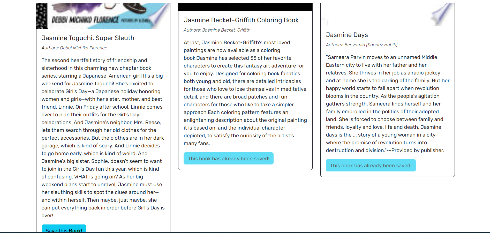

# book-search

# Description

This application is used for searching for books using the Google books API. A user login and signup, search for books, and save them to make a list.GraphQL API built with Apollo Server,Uses the MERN stack, with a React front end, MongoDB database, and Node.js/Express.js server and API.

* [GitHub Repository](https://github.com/LipikaManglaa/book-search.git)
* [Deployed GitHub IO]  git@github.com:LipikaManglaa/book-search.git

Live Link:

## Table of Contents

  
* [Description](#Description)

* [Screenshots](#Screenshots) 

* [Technologies-Used](#Technologies-Used)

* [Features](#Features)   

* [Installation](#installation)
  
* [Instructions](#Instructions) 
          
* [Questions](#questions)
 
* [License](#license)  

### Features
1) whwn you have alogin

2) After login , you can creat a liast to save book

3) view your books

4) if you no need anymore , delete books

### Technologies-Used
  * Graphql
  * Express.js
  * Node.js
  * MongoDB
  * Mongoose
  * @apollo/server
  * apollo-server-express
  * jsonwebtoken
  * @apollo/client
  * jwt-decode

### Installing

* To install this code, download the zip file, or use GitHub's guidelines to clone the repository. 

* Node.js and MongoDB is required to run the application

* To install dependiencs,run command npm i

## Instructions
If you would like to see how to create Book search engine API then you can check my github repo and let you know  how to cretae it

## License
This application is covered under the MIT license

## Questions
Created by: LipikaManglaa

If you have any further questions please feel free to contact me at lipika.mangla.web@gmail.com